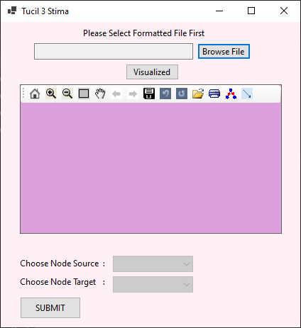

# Tucil3_13519174
Tugas Kecil 3 IF2211 Strategi Algoritma
Implementasi Algoritma A* untuk Menentukan Lintasan Terpendek

## General info

Algoritma A* (atau A star) dapat digunakan untuk menentukan lintasan terpendek dari suatu titik
ke titik lain. Pada tugas kecil 3 ini, anda diminta menentukan lintasan terpendek berdasarakan peta
Google Map jalan-jalan di kota Bandung. Dari ruas-ruas jalan di peta dibentuk graf. Simpul
menyatakan persilangan jalan atau ujung jalan. Asumsikan jalan dapat dilalui dari dua arah. Bobot
graf menyatakan jarak (m atau km) antar simpul. Jarak antar dua simpul dapat dihitung dari
koordinat kedua simpul menggunakan rumus jarak Euclidean (berdasarkan koordinat) atau dapat
menggunakan ruler di Google Map, atau cara lainnya yang disediakan oleh Google Map.

Langkah pertama di dalam program ini adalah membuat graf yang merepresentasikan peta (di area
tertentu, misalnya di sekitar kampus ITB). Sisi diperoleh dari jalan antar dua simpul dan bobot sisi
adalah jarak Euclidean. Berdasarkan graf yang dibentuk, lalu program A* menerima input simpul
asal dan simpul tujuan, lalu menentukan lintasan terpendek antara keduanya. Lintasan terpendek
dapat ditampilkan pada peta/graf. Nilai heuristik yang dipakai adalah jarak garis lurus dari suatu
titik ke tujuan.

Spesifikasi program:
1. Program menerima input file graf (direpresentasikan sebagai matriks ketetanggaan
berbobot), jumlah simpul minimal 8 buah.
2. Program dapat menampilkan peta/graf
3. Program menerima input simpul asal dan simpul tujuan.
4. Program dapat menampilkan lintasan terpendek beserta jaraknya antara simpul asal dan
simpul tujuan

Implementasi Algoritma A* untuk Menentukan Lintasan Terpendek 
Dibuat oleh:
Jusuf Junior Athala / 13519174

## Screenshots

## Technologies
* C# Language
* Visual Studio 2019

## Setup
1. Jalankan program Tucil3.exe yang berada di folder bin
2. Klik Choose File Button dan pilih text file input yang akan digunakan di folder test
3. Klik Visualize yang akan menampilkan graf.
4. Pilih simpul sumber dan simpul tujuan
5. Klik SUBMIT untuk menunjukkan hasil

(Catatan : Hasil build dari solution dalam folder src akan tersimpan dalam folder src/bin/debug/netcoreapp3.1
isi folder netcoreapp3.1 dapat dicopy ke bin folder pada folder utama)

